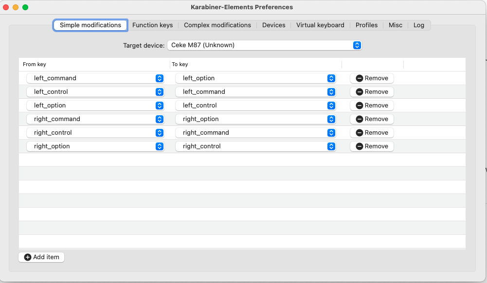
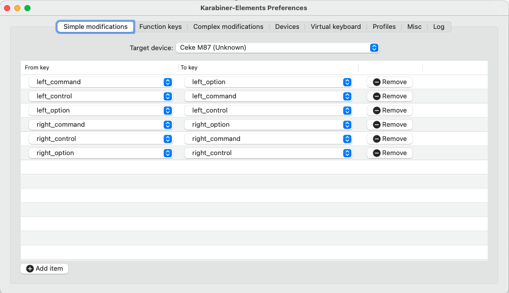

# ⌨️ Karabiner Configuration Files

## Overview
This section contains configuration files for Karabiner, a powerful keyboard customizer for macOS that allows advanced key remapping and complex modifications.

---

## 🖼️ Configuration Images

### Rule Configuration 1
**File:** `keymaps/karabiner/Karabiner_rule_1.png`
**Description:** Screenshot of the first Karabiner rule configuration showing key mapping setup.




### Rule Configuration 2
**File:** `keymaps/karabiner/Karabiner_rule_2.png`
**Description:** Screenshot of the second Karabiner rule configuration showing additional key mapping setup.



---

## ⚙️ Configuration File

### Karabiner JSON Configuration
**File:** `keymaps/karabiner/karabiner.json`

??? karabiner-config

    ```json
    --8<-- "keymaps/karabiner/karabiner.json"
    ```

---

## 🎯 Key Features
- Advanced key remapping for macOS
- Complex modification rules
- Custom keyboard layouts
- Enhanced productivity shortcuts